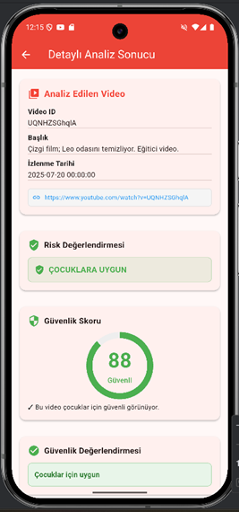
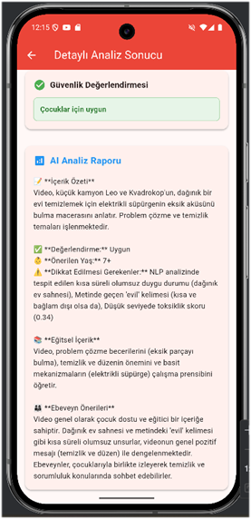
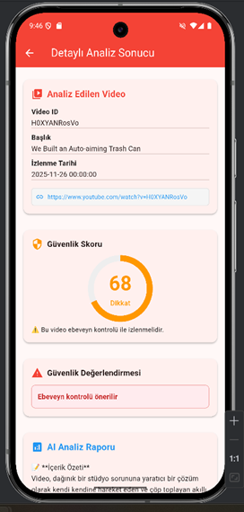
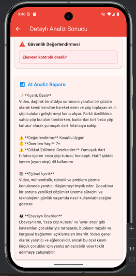
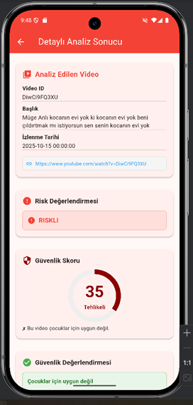
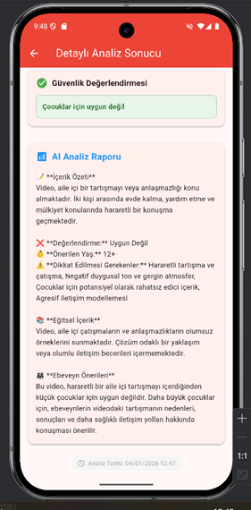

# Guardify v3 - Cocuklar Icin YouTube Icerik Analiz Sistemi

Bu proje, Google Takeout ile alinan YouTube izleme gecmisini analiz ederek videolarin cocuklar icin uygunluk durumunu degerlendirir.

Sistem iki ana parcadan olusur:
- Python Flask backend: Video analizi, NLP, multimodal degerlendirme
- Flutter mobil uygulama: Dosya yukleme, tarih secimi, sonuclarin gorsellestirilmesi

## Temel Ozellikler

- Google Takeout ZIP dosyasindan YouTube kayitlarini parse etme
- Tarihe gore filtreleme
- Video bazli guvenlik skoru (0-100)
- Risk siniflandirma:
  - Cocuklara Uygun
  - Az Riskli
  - Riskli
  - Cok Riskli
- Gemini destekli aciklayici analiz raporu
- Detayli analiz ekraninda video bilgisi + skor + yorum

## Proje Yapisi

- guardify_v2.py: Flask backend API
- child_guard/: Flutter uygulamasi
- docs/screenshots/: README icin ekran goruntuleri

## Mimari Akis

1. Kullanici Flutter uygulamasinda Google Takeout ZIP dosyasini secer.
2. Uygulama POST /analyze endpointine dosya ve secili tarihi gonderir.
3. Backend ZIP icinden YouTube linklerini ve tarih bilgisini cikarir.
4. Tarih filtresi uygulanir, videolar analiz edilir.
5. NLP + multimodal degerlendirme ile safety_score uretilir.
6. Sonuclar Flutter tarafinda liste ve detay ekraninda gosterilir.

## API Endpoints

- GET /health
  - Servis saglik kontrolu
- POST /analyze
  - Form-data ile file (ZIP) ve target_date (opsiyonel) alir
  - Analiz sonucunu JSON olarak doner

## Calistirma Rehberi

### 1) Backend

PowerShell:

```powershell
cd C:\Users\elf\Desktop\windsurfProje
.\.venv\Scripts\Activate.ps1
$env:GEMINI_API_KEY="YOUR_GEMINI_API_KEY"
python guardify_v2.py
```

Backend varsayilan olarak 5000 portunda calisir.

### 2) Flutter App

PowerShell:

```powershell
cd C:\Users\elf\Desktop\windsurfProje\child_guard
flutter pub get
flutter run
```

## Baglanti Notu

Flutter tarafindaki API adresi su dosyada bulunur:
- child_guard/lib/consts.dart

Platform bazli adres kullanimi:
- Android emulator: http://10.0.2.2:5000/analyze
- iOS simulator/Desktop: http://localhost:5000/analyze
- Fiziksel cihaz: flutter run komutuna API_URL verin

Ornek (fiziksel cihaz):

```powershell
flutter run --dart-define=API_URL=http://YOUR_LOCAL_IP:5000/analyze
```

## Guvenlik (GitHub Oncesi)

- API anahtarlarini kod icine yazmayin.
- Gercek anahtar sadece lokal ortam degiskeninde olsun.
- .env dosyasini repoya eklemeyin.

Ornek:

```powershell
$env:GEMINI_API_KEY="YOUR_GEMINI_API_KEY"
```

## Ornek Cikti Yapisinin Ozeti

- success
- target_date
- statistics
  - total_videos_in_takeout
  - unique_videos
  - date_filtered
  - analyzed
  - average_safety_score
  - processing_time_seconds
- videos[]
  - video_id, title, url, watch_date
  - analysis.multimodal_evaluation.safety_score
  - analysis.multimodal_evaluation.gemini_analysis

## Ekran Goruntuleri (6 Adet)

<pre>
       
</pre>
## Sorun Giderme

- ModuleNotFoundError alirsaniz:
  - Sanal ortamin aktif oldugunu kontrol edin
  - Eksik paketleri .venv icine yukleyin
- Backend calisiyor ama app baglanamiyorsa:
  - child_guard/lib/consts.dart icindeki IP adresini kontrol edin
  - Ayni agda oldugunuzdan emin olun
- Analiz yavas ise:
  - Ilk model yuklemeleri normal olarak daha uzun surebilir

---

Hazirlayan: elfkosar21@gmail.com
